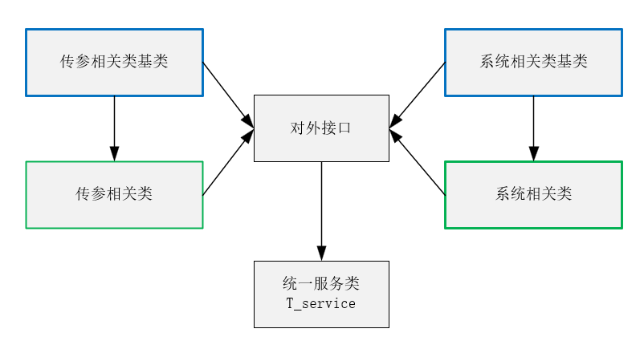

### 架构



### 传参相关类基类

#### T_baseData 

##### 1.类名：T_baseData 

作用：基础表格数据类 操作rule 行规则、fileInfo文件库信息、rowData 行数据

##### 2.属性

```js
 // 行数据规则 
rule: I_rule; 
 /* 每行数据系统默认字段_file_info_id_存放文件库id通过文件 
库信息表达来操作文件库，文件库常用于行附件，图片，缩略图的需求
*/
 fileInfo: object = {};  
// 行数据为一个{field:"字段名",value:"字段值"}数组
  rowData: I_fv[];                     
```

##### 3.方法

```js
 //设置行规则
 +setDataRule(p: I_rule): T_baseData 
//设置行数据
  +setRowData(...p: I_fv[]): T_baseData 
 //设置文件信息
  +setFileInfo(p: object): T_baseData   
```

##### 4.constructor


````ts    
this.rowData = [] as I_fv[];   //构造空数组
​this.rule = new T_rule();      //构造生成规则实例
````


>>>>>>> master

##### 5.举例说明

``` js
const d = new ts.T_baseData();
d.setRowData(...(el as ifs.I_fv[]));
d.fileInfo = {};
d.rule = {} as ifs.I_rule;
o.data.push(d);
```


####   T_fv     

##### 1.类名： T_fv

作用：设置通用 {field,value}

##### 2.属性

```js
field: string;
value: string | number | boolean | null;
```

##### 3.方法

```js
//返回当前实例
setField(p: string): T_fv       
setValue(p: string | number | boolean | null): T_fv 
export interface I_fv extends T_fv {}
```

##### 4.constructor： 无

##### 5.举例说明


####  T_rule

##### 1.类名： T_rule

作用：规则类

##### 2.属性

```js
// qbe过滤
+ QBE?: T_qbe;    
// 统计信息
+ statistics?: T_statistics;    
// 执行规则before
- beforeExecRule: T_execRule[] = [];    
// 执行规则after
- afterExecRule: T_execRule[] = [];    
```

##### 3.方法

```js
+ setQBE(p: I_qbe): T_rule   
+ setStatistics(p: I_statistics): T_rule
// 执行规则before
+ setAeforeExecRule(...p: I_execRule[]) 
//取得执行前规则
+ getBeforeExecRule(): T_execRule[]   
// 执行规则after
+ setAfterExecRule(...p: I_execRule[])
//取得执行后规则
+ getAfterExecRule(): T_execRule[]   
export interface I_rule extends T_rule {}
```

##### 4.constructor：无

##### 5.举例说明


##### T_rule的子类

###### T_qbe

1.类名： T_qbe
作用：查询时过滤规则类
2.属性

```js
+funName: string;                 //作业名称
+fieldName: string;               //字段名称
```

3.方法

```js 
+ public setFunName(p: string): T_qbe 
+ public setFieldName(p: string): T_qbe
export interface I_qbe extends T_qbe {}
```

4.constructor：无


###### T_statistics

1.类名：T_statistics
作用：统计信息
2.属性

```js
+ alais: string;       // 返回的别名不能与查询字段同名
+ pipeline: object;     // 一个bson管道表达式
```

3.方法

```js
setAlais(p: string): T_statistics 
+setPipeline(p: object): T_statistics  
export interface I_statistics extends T_statistics {}
```

4.constructor： 无


###### T_execRule

1.类名：T_execRule
作用：规则执行类
2.属性

```js
 // 执行顺序号
+ sn: number = 0;
 // 触发 before 执行前 after 执行后 undefine 无定义
+ trigger: string = 'undefine'; 
 // 规则名
+ name: string;  
 // 传入参数
+ inArg: Array<{ name: string; dataType: string; value: any }> = [];
// 返回参数
+ outArg: Array<{ name: string; dataType: string; value: any }> = [];  
// DB 规则执行存储过程 |General 一般软件逻辑
+ type: string;  
 // 不否包含事务 如果type =DB 则此项有效
+ isDbTransactions: boolean; 
```

3.方法

```js
export interface I_execRule extends T_execRule {}
```

4.constructor：  无

### 传参相关类

#### bpa

作用：单据的增、删、改操作

##### bpa的子类

###### T_bpaHeadDelRec

1.类名：T_bpaHeadDelRec
作用： bpa单头删除类，存放单头删除条件
2.属性

```js
   + filter!: object;    //条件
   + rule: I_rule;       //规则  
   + mto!: { rule: I_rule; dbType: string; tableName: string; filter: object }[];  //单身多对一
```

3.方法: 无

   + mto!: { rule: I_rule; dbType: string; tableName: string; filter: object }[];  //单身多对一

>>>>>>> master
    构造：

    constructor() {
    
    this.filter = {};
    this.rule = new T_rule();
    this.mto = [];
  }
方法: 无

4.constructor

```js
constructor() {
this.filter = {};
this.rule = new T_rule();
this.mto = [];
```

5.用法实例

```js
const o = new ts.T_bpaHeadDelRec();
export interface I_bpaHeadDelRec extends T_bpaHeadDelRec {}
```


###### T_bpaHeadInsRec

1.类名：T_bpaHeadInsRec  继承T_baseData
作用： bpa单头新增类，存放单头bpa插入数据记录

2.属性：无 

3.方法:  无  

4.constructor：无  
export interface I_bpaHeadInsRec extends T_bpaHeadInsRec {}

###### T_bpaHeadUpdRec  

1.类名：T_bpaHeadUpdRec   继承T_baseData
作用： bpa单头新增类，存放单头bpa插入数据记录
2.属性： + filter: object;   //过滤条件

3.方法:  无   

4.constructor

```js
constructor() {
    super();
    this.filter = {};
  }
```

export interface I_bpaHeadUpdRec extends T_bpaHeadUpdRec {}


###### T_bpaHead 

1.类名：T_bpaHead  继承 T_bpaHead
作用： 用于封装 bpa 头的新增、删除、更改入口
2.属性

```js
 //新增
+insertRecords?: I_bpaHeadInsRec; 
 //更新
 +updateRecords?: I_bpaHeadUpdRec;
 //删除
 +removeRecords?: I_bpaHeadDelRec;   
```

3.方法

```js
//设置传入的值
+ setInsertRec(p: I_bpaHeadInsRec): T_bpaHead
//设置传入的值
  + setUpdateRec(p: I_bpaHeadUpdRec): T_bpaHead
//设置传入的值
  +setRemoveRec(p: I_bpaHeadDelRec): T_bpaHead  
  export interface I_bpaHead extends T_bpaHead {}
```


4.constructor

```js
 //继承 T_bpaHead的构造
constructor() {
    super();   
    this.insertRecords = new T_bpaHeadInsRec();
    this.updateRecords = new T_bpaHeadUpdRec();
    this.removeRecords = new T_bpaHeadDelRec();
  }
```


  

###### T_bpaBodyInsRec

1.类名：T_bpaBodyInsRec
作用：bpa单身插入
2.属性

```js
 + scope: object;
 + data: I_baseData[];
```

3.方法

```js
+ setScope(p: object): T_bpaBodyInsRec 
+ setData(...d: T_baseData[]): T_bpaBodyInsRec
```

4.constructor

```js
constructor() {
 this.data = [];
 this.scope = {};
 }
```

5.举例说明

```js
 const o = new ts.T_bpaBodyInsRec();
    o.setScope(scope);
    res.forEach(el => {
      const d = new ts.T_baseData();
      d.setRowData(...(el as ifs.I_fv[]));
      d.fileInfo = {};
      d.rule = {} as ifs.I_rule;
      o.data.push(d);
    });
```


export interface I_bpaBodyInsRec extends T_bpaBodyInsRec {}

###### T_bpaBodyUpdRec

1.类名：T_bpaBodyUpdRec

作用： bpa单身更新类，处理bpa单身更新数据记录

2.属性：无 
constructor：无 
3.方法:  无   
export interface I_bpaBodyUpdRec extends T_bpaBodyUpdRec {}

######  T_bpaBodyDelRec

1.类名： T_bpaBodyDelRec
作用： bpa单身删除类，处理bpa单身删除数据记录
2.属性

```js
+ rule: I_rule
+ filter: object;
* constructor：
  constructor() {
    this.rule = {} as I_rule;
  }
```

3.方法：无
export interface I_bpaBodyDelRec extends T_bpaBodyDelRec {}


###### T_ctdUpdRec

1.类名：T_ctdUpdRec

作用：将T_ctdUpdData数据明细增加到T_ctdUpdRec.data

2.属性

```js
+ data: I_ctdUpdData[];
constructor：
 constructor() {
    this.data = [] as I_ctdUpdData[];
  }
```

3.方法

```js
 //设置数据
+setData(fileInfo: object,filter: object,rule: I_rule, ...fv: I_fv[]): T_ctdUpdRec 
//设置单条数
+setCtdUpdData(p: I_ctdUpdData): T_ctdUpdRec     
 //设置多条数据
+setCtdUpdDatas(...p: I_ctdUpdData[]): T_ctdUpdRec                                    
```

4.举例说明

```js
 const TinsUpd = new ts.T_ctdUpdRec();
 TinsUpd.setData({}, Tfilter.parseEQ('id', id), Trule, a);
```

export interface I_ctdUpdRec extends T_ctdUpdRec {}

###### T_bpaBody 

1.类名：T_bpaBody  
作用：bpa API Body 单身类，产生单身数据处理实例
2.属性

```js
//规则
+ rule: I_rule;   
//数组数据对象
 + data!: {                                                            
   tableName: string;
   dbType: string;
   insertRecords?: I_bpaBodyInsRec;
   updateRecords?: I_bpaBodyUpdRec;
   removeRecords?: I_bpaBodyDelRec;
   }[];
   constructor：
   constructor() {
   this.data = [];
   }
```

3.方法: 无
4.举例说明

```js
export interface I_bpaBody extends T_bpaBody {}
```

###### T_bpaArg

1.类名：T_bpaArg
作用：bpa API 参数接口实列
2.属性

```js
url: string = lexicon.url.bpa;
#cancel?: any;
+head: I_bpaHead;
+body: I_bpaBody;
```

3.方法

```js 
//设置单头数据
+setHead(p: I_bpaHead): T_bpaArg  
//设置单身数据
+setBody(p: I_bpaBody): T_bpaArg  
 //设置取消
+setCancel(p: any): T_bpaArg  
 //输出Json对象
outJson():T_return                           
```

4.constructor

```js
  constructor() {
    this.head = new T_bpaHead();
    this.body = new T_bpaBody();
  }
```

5.举例说明

```js
const bpa = new ts.T_bpaArg();
return bpa.setHead(this.getBpaHead()).setBody(this.getBpaBody());
export interface I_bpaArg extends T_bpaArg {}
```


  

###### T_addbpaArg

1.类名：T_addbpaArg
作用：bpa API 新增参数结构接口
2.属性

```js
- url: string = lexicon.url.bpa;
  +cancel?: any;
+ head?: {funName: string; dbType: string;rule: I_rule;insRec: I_bpaHeadInsRec; };
+ body?: { bodyRule: I_rule; data: { tableName: string; dbType: string;insRec: I_bpaBodyInsRec;}[];
```

3.方法： 无

4.constructor

```js
constructor() {
  this.head = {
    funName: '',
    dbType: '',
    insRec: new T_bpaHeadInsRec(),
    rule: new T_rule()
  };
  this.body = {
    bodyRule: new T_rule(),
    data: []
  };
}
```

5.举例说明

```js
if (p instanceof ts.T_addbpaArg)    //用 instanceof 运算符来判断 p 是否是 ts.T_addbpaArg 或其子类的实例。如果是，那么表达式的结果将会是 true，否则是 false。
```

export interface I_addbpaArg extends T_addbpaArg {}


###### T_updbpaArg

1.类名：T_updbpaArg
作用：bpa API 更改参数结构接口
2.属性

```js
- url: string = lexicon.url.bpa;
  +cancel?: any;
+ head?: {funName: string; dbType: string;rule: I_rule;updRec: I_bpaHeadUpdRec; };
+ body?: { bodyRule: I_rule; data: { tableName: string; dbType: string;updRec: I_bpaBodyUpdRec;}[];
```

3.方法： 无
4.constructor

```js
constructor() {
  this.head = {
    funName: '',
    dbType: '',
    updRec: new T_bpaHeadUpdRec(),
    rule: new T_rule()
  };
  this.body = {
    bodyRule: new T_rule(),
    data: []
  };
}
```

5.举例说明

```js
if (p instanceof ts.T_updbpaArg)    //用 instanceof 运算符来判断 p 是否是 ts.T_updbpaArg 或其子类的实例。如果是，那么表达式的结果将会是 true，否则是 false。
```

export interface I_updbpaArg extends T_updbpaArg {}


###### T_delbpaArg

1.类名：T_delbpaArg
作用：bpa API 删除参数结构接口
2.属性

```js
- url: string = lexicon.url.bpa;
  +cancel?: any;
+ head?: {funName: string; dbType: string;rule: I_rule;delRec: I_bpaHeadDelRec; };
+ body?: { bodyRule: I_rule; data: { tableName: string; dbType: string;delRec: I_bpaBodyDelRec;}[];
```

3.方法： 无

4.constructor

```js
constructor() {
  this.head = {
    funName: '',
    dbType: '',
    delRec: new T_bpaHeadDelRec(),
    rule: new T_rule()
  };
  this.body = {
    bodyRule: new T_rule(),
    data: []
  };
}
```

5.举例说明

```js
//用 instanceof 运算符来判断 p 是否是 ts.T_delbpaArg 或其子类的实例。如果是，那么表达式的结果将会是 true，否则是 false。
if (p instanceof ts.T_delbpaArg)    
```

export interface I_delbpaArg extends T_delbpaArg {}

### 系统相关类基类

#### T_base

##### 1.类名：T_base

作用：本地方法集、本地web包、本地url词典的引入，组件箱设定取用，取用本地store相关方法，接口暴露

##### 2.属性

```js
 //方法库
utils: T_utils 
// 引入xeUtil包方法集
 XEUtils: T_XEUtils  
// 本地方法集
libUtils: T_libUtils   
// 词典
lexicon: typeof libLexicon 
 // 本地web包
cookies: typeof libCookies   
// 本地url词典
web: typeof libWeb  
// 本地store
url: typeof libLexicon.url                                      
 store: any                                                         
```

##### 3.方法

```js
//取本地store的UserID  
+ getUserID():return string  
//取本地store的UserNo
   + getUserNo():return string  
//取本地store的UserName
   + getUserName():return string 
 //取本地store的DBName
   + getDBName():return string
  //取本地store的SysDBName
   + getSysDBName():return string
  //取本地store的SnowWorkID
     +getSnowWorkID():return bigint  
 //取本地store的SnowWorkSeed
   + getSnowWorkSeed:return bigint 
 //取本地store的Store
   + getStore:return any  
//查找Ref
   + lookupRefs(obj:any ref:string):return any 
 //取组件箱
   + get compBox(): return I_compBox    
 //设置组件箱
   + set compBox(): return I_compBox               
```

##### 4.constructor：无


#### T_return

##### 1.类名：T_return

作用：内部带返回Map可用在函数多返回类型

##### 2.属性

```js
_err!: string;
```

##### 3.方法

```js
  + set errmsg(errmsg: string) 
  + get errmsg(): string   
  + error(errmsg: string): T_return<T> 
  + isErr(): boolean
  + getReturnData(key: string): any
  + getReturnDataMap(): Map<string, any> 
  + setReturnData(key: string, value: any) 
```


##### 4.constructor

```js
 constructor(errmsg?: string | '') {
 this._err = errmsg;
 this.returnData = new Map();
    }
```

export interface I_return<T = any> extends T_return<T> {}

​       

#### T_snowID 

##### 1.类名： T_snowID 

作用：产生snowID

##### 2.属性

```js
// 表示每个集群下的每个节点，1毫秒内可生成的id序号的二进制位数 即每毫秒可生成 2^12-1=4096个唯一ID
- workerBits: bigint;     
  - numberBits: bigint;
  - workerID: bigint; 
 // 这里求最大值使用了位运算，-1 的二进制表示为 1 的补码  
// -1 ^ (-1 << nodeBits) 这里是不是等于 1023 节点ID的最大值，用于防止溢出
  - workerMax: bigint;  
  // 用来表示生成id序号的最大值
  - numberMax: bigint; 
// 时间戳向左的偏移量
  - timeShift: bigint;  
// 记录的时间戳
  - workerShift: bigint;    
  - timestamp: bigint;
 // 记录同一时间timestamp 产生的ID数
  - number: bigint;    
/* 41位字节作为时间戳数值的话 大约68年就会用完
      // 假如你2010年1月1日开始开发系统 如果不减去2010年1月1日的时间戳 那么白白浪费40年的时间戳啊！
      // 这个一旦定义且开始生成ID后千万不要改了 不然可能会生成相同的ID 1596666666666
  - private seed: bigint;  */
```

##### 3.方法

```js
  + snowSeed(): bigint                 
  + set snowSeed(seed: bigint)   
  + get snowWorkID(): bigint 
  + set snowWorkID(workID: bigint) 
  + getSnowID(): bigint
```

##### 4.constructor

```js
  constructor() {
    this.workerBits = 10n;
    this.numberBits = 12n;
    this.workerMax = -1n ^ (-1n << this.workerBits);
    this.numberMax = -1n ^ (-1n << this.numberBits);
    this.timeShift = this.workerBits + this.numberBits;
    this.workerShift = this.numberBits;
    this.seed = -1n;
    this.workerID = -1n;
    this.timestamp = 0n;
    this.number = 0n;
  }
```

export interface I_snowID extends T_snowID {}

#### T_data

##### 1.类名：T_data

作用：前端数据进行后端处理的接口

##### 2.属性 : 无

##### 3.方法

```js
 // 标准通用post API
async standardPostReq<Tres, Treq>(p: Treq,url?: string): Promise<[Tres, string]>                         // 获取数据1                 
+async getData<TresRowsObj, Treq>(p: Treq,url?: string): Promise<[boolean, ifs.I_queryRes<TresRowsObj>, TresRowsObj[], string]> 
 // 获取数据2    
+async getSLCData(id: string,dbType: string,lang: string  ): Promise<[boolean, { label: string; value: number }[], string]>   
 // 获得默认值    
+getDefaultVal(defVal: ifs.I_devVal): Promise<ifs.I_fv[]>   
// 获取数据3    
+async getDataWithOption(lang: string,dbType: string,tableName: string,agreedFields: Array<string>,filter: object, funName?: string ): Promise<[boolean, ifs.I_queryRes<any>, any[], string]> 
 //增加记录    
+async addRows(tableName: string,dbType: string, rule: ifs.I_rule, p: ifs.I_ctdInsRec): Promise<[boolean, ifs.I_setDataRes, any]>  
  //更新记录   
+async updRows(tableName: string,dbType: string,rule: ifs.I_rule, p: ifs.I_ctdUpdRec ): Promise<[boolean, ifs.I_setDataRes, any]>
  //删除记录   
+async delRows(tableName: string, dbType: string, rule: ifs.I_rule,p: ifs.I_ctdDelRec ): Promise<[boolean, ifs.I_setDataRes, any]>   
   //混合操作记录  
+async batRows(p: ifs.I_ctdArg): Promise<[boolean, ifs.I_setDataRes, string]>                             //设置单据                                                       
-setBpa(bpa: ts.T_bpaArg, p: ifs.I_addbpaArg | ifs.I_updbpaArg | ifs.I_delbpaArg): ifs.I_return  
 //执行处理
-async bpaExec(p: ifs.I_addbpaArg | ifs.I_updbpaArg | ifs.I_delbpaArg): Promise<[boolean, ifs.I_setDataRes, string]>   
  //增加单据   
-async addBill(p: ifs.I_addbpaArg): Promise<[boolean, ifs.I_setDataRes, string] 
 //修改单据
+async updBill(p: ifs.I_updbpaArg): Promise<[boolean, ifs.I_setDataRes, string]>   
 //删除单据   
+async delBill(p: ifs.I_delbpaArg): Promise<[boolean, ifs.I_setDataRes, string]>  
 //混合处理单据   
+async batBill(p: ifs.I_bpaArg): Promise<[boolean, ifs.I_setDataRes, string]>  
 //获取系统数据并存store    
+async getSysInfo(): Promise<[ifs.I_sysInfoRes, string]>  
  //  
+async ruleQuery<TresRow>(req: ifs.I_ruleReq): Promise<[boolean, any, TresRow[], string]>  
+async ruleSave(req: ifs.I_ruleReq): Promise<[boolean, ifs.I_setDataRes, string]>
+async ruleDelete(req: ifs.I_ruleReq): Promise<[boolean, ifs.I_setDataRes, string]>
//设置数据    
+async setData<Treq>(p: Treq, url?: string): Promise<[boolean, ifs.I_setDataRes, string]>  
//post    
+async webPost<Tres, Treq>( p: Treq, url?: string): Promise<[Tres, string]>
//http post    
+async httpPost<Treq>(p: Treq, url?: string): Promise<any>                                               
+getReqFmt<T>(p: T): string
```


#### T_compBox  组件箱

##### 1.类名：T_compBox  组件箱

作用:方便在复杂的组件中快速相互通讯

##### 2.属性

 -_emitGUID: string;                  // 事件GUID

 - compMap = new Map();       //组件箱
    构造：
   constructor(GUID: string) {
    // 最终应用组件统一用此GUID 可参考开发模块devModal主index.vue写法
    this._emitGUID = GUID;
    }

##### 3.方法

```js
// 以下划线分格合并字串
-mergeName(compID: string, name: string, funName?: string): string   
 // 注入组件引用
+addComp(name: string, comp: any)                                             
 // 批量注入组件引用
+addComps(objs: Array<{ name: string; comp: any }>)   
 // 注入组件引用将 compID+_+funName?+_+name合并为组件key
+addCompMergeName(compID: string,name: string, comp: any, funName?: string)  
 // 批量注入组件引用将 compID+_+funName?+_+name合并为组件key
+addCompsMergeName(compID: string, objs: Array<{ name: string; comp: any }>,  funName?: string )  
 // 删除组件箱对象引用
+removeComp(name: string)  
 // 批量删除组件箱对象引用
+removeComps(names: Array<string>)   
 // 删除组件箱对象引用 将compID+_+funName?+_+name合并为组件key
+removeCompMergeName(compID: string,name: string, funName?: string): void   
// 批量删除组件箱对象引用 将compID+_+funName?+_+name合并为组件key
+removeCompsMergeName(compID: string, names: Array<string>, funName?: string): void   
 // 删除以ID开头的引用
+removeCompsWithCompID(compID: string): void   
//  获取组件箱中对象实例
+getComp(name: string): any  
//  批量获取组件箱中对象实例
+getComps(names: Array<string>): Array<{ name: string; comp: any }> 
 //  获取组件箱中对象实例 将compID+_+funName?+_+name合并为组件key    
+getCompMergeName(compID: string, name: string, funName?: string): any  
 //  批量获取组件箱中对象实例 将compID+_+funName?+_+name合并为组件key 返回name是传入names的值非compBox key
+getCompsMergeName(compID: string,names: Array<string>,funName?: string): Array<{ name: string; comp: any }>  
 // 获取组件ID   
+get emitGUID(): string     
  // 外部应用间统一ID
+getDefGUID(): string   
//将本类实例通过事件广播
+broadcast(emitGUID?: string)    
```


4. constructor

   ```js   constructor(GUID: string) {
    // 最终应用组件统一用此GUID 可参考开发模块devModal主index.vue写法
    this._emitGUID = GUID;
      }
   ```

   

### 系统相关类


