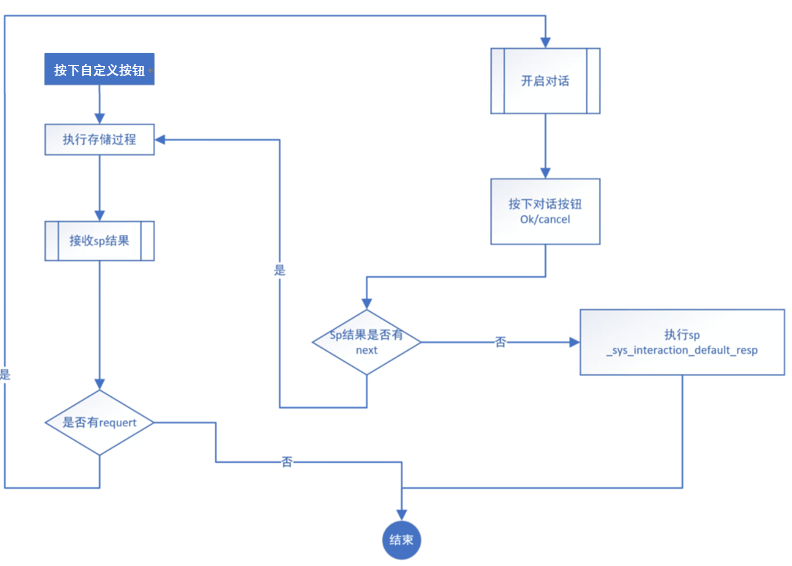

<!-- 在前端封装一系列的共用对象来处理在某些功能需要用到的操作交互。
构想：由后端或者是DB存储过程 ，

1.0是fun.action 2.0是/utils/event来发送控制信息来达到灵活配置的目的。

1、以json格式设计协议来提供交互功能。
1.1 打开其它功能
1.2 dialog

跨平台

1.3 向导
。。。以后扩展
2、前端封装标准的共用组件以专类来提供上面的服务。 -->

#### 交互流程

```text
1.客户端按下自定义按钮调用执行存储过程
2.客户端接收sp结果，并判断sp结果中是否有request参数，
  没有就结束，
  有则根据sp结果中的cmd参数打开对应对话窗口(弹窗，功能面板，打开功能)
3.客户端按下对话按钮(ok/cancel)后判断sp结果是否有next参数，
  没有执行默认 sp_sys_interaction_default_resp 然后结束,
  有则调用下一存储过程。
```


> 以下根据存储过程名传输 提示框 | 功能面板 | 打开功能 json数据 
### 提示框JSON格式 

````json

{
    "success":true,
    "msg":"200,DB,0,Successful operation",
    "data":null,
    "request":{
        "cmd":"dialog",                         //可选值 'dialog'|'funPanel'|'openFun'
        "msgContent":{
           "workID":"123",                     //产生唯一工作ID
            "type":"alert",                    //可选值 'alert'| 'confirm' | 'message'
            "status":"into",                   //可选值 'info'| 'success' | 'warning' | 'error' | 'loading'
            "title":"这是标题", 
            "content":"这是内容" 
        },
        "next":{                               //【非必需】执行完存储过程后如果有下一下存储过程 
          "ok":{
                "spName":"xxx", //下一个存储过程 
          },
          "cancel":{
                "spName":"xxx", //下一个存储过程 
          }
       
        }                   
    }
}

返回：pData
{
    ...
    "resp":{
       "workID":"123",
       "action":"confirm" //confirm 确认按钮 cancel 取消
       "data":null  
    }
   
}

````

### 功能面板JSON格式 

````json
{
    "success":true,
    "msg":"200,DB,0,Successful operation",
    "data":null,
    "request":{
        "cmd":"funPanel", //可选 'dialog'|'funPanel'|'openFun'
        "msgContent":{
           "workID":"123", //产生唯一工作ID
           "title":"这是标题", 
           "group":{   //分组
               "name":[  //分组名
                  {
                      "form":{
                         "uiID":"123",  //识别表单的编号
                          "formColumnNum":4, //【非必需属性】
                         "fields":[
                 				  {
                                       "field":'f1',                    //字段名
                                       "type":'varchar(20)'             //数据库类型 
                                         // radio 组件排列
                                       "radioArrang":'h'       //【非必需属性】(v)Vertical (h)Horizontal
                                       "radioOptions": [               //单选     【非必需属性】
                                                     { "label": '是', "value": 'Y' }, 
                                                     { "label": '否', "value": 'N' }
                                       ],
                                       "many2one": {                    //放大镜选项            【非必需属性】
                                            "toTable": ''             //表名
                                            "toField": ''             //字段  toTable 描述字段。 
                                       },
                                       // 下拉选项字段附加列表ID   【非必需属性】 
                                       // 前题  1、字段附加列表ID 2、数据类型 int smallint  
                                       "selectionID":""               
                                  }
              		 ],
                     }，
                   "table":{
                       "uiID":"123", //识别表的编号
                       "columns":[
                           {
                               "field":xxx  //字段名
                              
                                "editComp":{
                                 "type": "input"  // input select 
                                 "selectList":[    //type =select 有效
                                   {"lable":"a","value":11},
                                   {"lable":"b","value":22}
                                  ]
                               }
                           }
                           ...
                       ]
                   }
                 } 
               ],
           },
          
           
           //就是默认值    【非必需属性】
          "initValue":{
                      "tableData":{    //表数据  【非必需属性】
                           "uiID":[    // ui编号  
                                {"field":xxx,"value":xxx}  // 行默认数据 字段名 默认值
                            ]
                           ...
                       },
                       "formData":{  //表单数据  【非必需属性】
                          "uiID" {"field":xxx,"value":xxx ...}
                       }
             
          }，  
          "style":{                                 //样式          【非必需属性】
               "resize":false,                      // 是否允许窗口边缘拖动调整窗口大小
               "showClose":true,                    // 是否显示关闭按钮
               "showZoom":true,                     // 标题是否标显示最大化与还原按钮
               "escClosable":false,                 // 是否允许按 Esc 键关闭窗口
               "width":800,                         // 宽度
               "height":600,                        // 高度
               "minWidth":400,                      // 最小宽度
               "minHeight":300,                     // 最小高度
               "mask":false,                         // 是否显示遮罩层
          
    
           
          }  
        },
        "next":{                //【非必需】执行完存储过程后如果有下一下存储过程 
            "ok":{
                "spName":"xxx", //下一个存储过程 
            },
            "cancel":{
                "spName":"xxx", //下一个存储过程 
            }
        }   
    }
}

返回：pData
{
    "resp":{
        "workID":"123",
    "action":"confirm" //confirm 确认按钮 cancel 取消
        "data":{
            "uiID" : [ //配置中指定的ID
               
                 {"field":"xxx","value":"xxx"}
                  ...
                ]
             
        }
    }           
}
````

### 打开功能JONS格式 

````json
{
    "success":true,
    "msg":"200,DB,0,Successful operation",
    "data":null,
    "request":{
        "cmd":"openFun",                         //可选值 'dialog'|'funPanel'|'openFun'
        "msgContent":{
           "workID":"123",                     //产生唯一工作ID
            "funName":"",                      //打开主功能名
            "filter":[                                                 //【非必需属性】
                {"field":"xxx","value":"xxx"}
            ]
           "hideList":{                                                //【非必需属性】
               "toolbar":['a','b'],       //工具栏按钮
               "column":['c','d']         //表字段
           }
        },
        "next":{                //【非必需】执行完存储过程后如果有下一下存储过程 
            "ok":{
                "spName":"xxx", //下一个存储过程 
            },
            "cancel":{
                "spName":"xxx", //下一个存储过程 
            }
        }   
    }
}

返回：pData
{
    ...
    "resp":{
       "workID":"123",
       "action":"confirm" //confirm 确认按钮 cancel 取消
        "data":{
                "selectColumns" : [//选中的row数据

                    {"id":"xxx",...}
                    ...
                ]
        }  
    }
   
}
````

